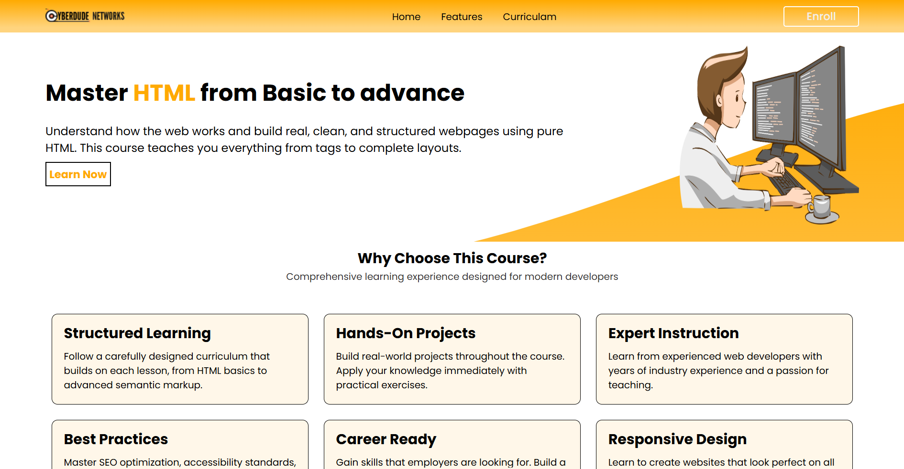

# 📘 **HTML Course Landing Page – Internship Week 2**

### CyberDude Networks Pvt. Ltd – Frontend Development Internship

Live Demo 👉 **https://cyberdude-htmlcourselandingpage.vercel.app/**

---
### ScreenShot

### Figma Layout Design

## 🚀 **Project Overview**

This project is part of **Week 2 of my Internship at CyberDude Networks Pvt. Ltd.**  
The task was to design and build a **responsive HTML Course Landing Page** using:

- **HTML5**
- **CSS3**
- **Responsive Layout**
- **Basic Animations**
- **Modern UI/UX Design Principles**
